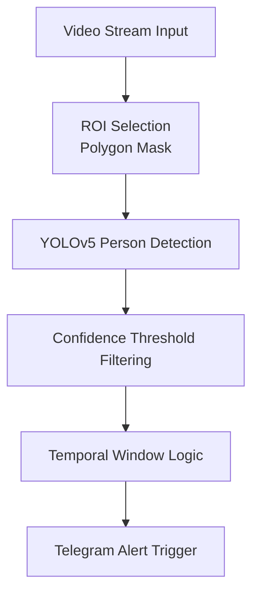

# Intrusion Detection System with Real Time Telegram Alerts

A computer vision–based intrusion detection system that uses YOLOv5 for person detection, OpenCV for Masking, and a chatbot for sending real time alerts to Telegram.
The added functionality is that the user can define his Region of Interest (ROI) by drawing a ploygon on the feed and detection happens in that ROI only.
A confidence threshold of > 60% is used along with debounce and false-positive control which leads to 98% accuracy in alert triggering.
An alert message acoompanied by a captured frame of intrusion is then triggered to the user's Telegram.

This project can be practically deployed for intrusion detection on campus frames and boundaries and can be extended to other industrial usage like PPE detection in a particular ROI.

## System Architecture:



## Accuracy & False Positive Control

Intrusion alerts are triggered **only when all conditions are satisfied**:

- A person is detected **inside the ROI**
- Detection remains stable across multiple frames
- Minimum positive frame count is reached
- Cooldown period since last alert has elapsed

This approach significantly reduces:
- One-frame false positives
- Flickering detections
- Alert flooding

> Achieved ~98% reliable alert triggering during controlled testing
 

## Demo Screenshots

### ROI Polygon Selection


### Detection Within Masked ROI


### Telegram Alert With Captured Frame


## Installation and Setup

1) Clone the repository:
   ```bash
   git clone https://github.com/Aman-Sarin/intrusion-detection-telegram-alert.git
   cd intrusion-detection-telegram-alert
   ```
2) Create virtual environment:
   ```bash
   python -m venv venv
   source venv/bin/activate   # Linux/Mac
   venv\Scripts\activate      # Windows
   ```
3) Install dependencies:
   ```bash
   pip install -r requirements.txt
   ```

## Telegram Bot Setup

Create a bot using BotFather
Get:
```md
BOT_TOKEN
CHAT_ID
```
Update them in main.py in place of 
```md
import os
    BOT_TOKEN = os.getenv("TELEGRAM_BOT_TOKEN")
CHAT_ID = 12345678
```

## Running the project

```bash
python src/main.py
```
Controls:
1) Press q to exit video stream
2) Selection of polygon with left mouse button and finalizing ROI with right mouse button


## Future Improvements

1) Send intrusion video alerts
2) Multi-camera support
3) Person tracking (DeepSORT)
4) Other use cases apart from human - PPE, any animal, etc.

## Author

Aman Sarin
Assistant Manager – Supply Chain (Industrial Digital Transformation)
| Electronics & Instrumentation Engineer (NIT Rourkela)

🔗 GitHub: https://github.com/Aman-Sarin
| 🔗 Interests: Computer Vision, Industrial Automation


  


   


